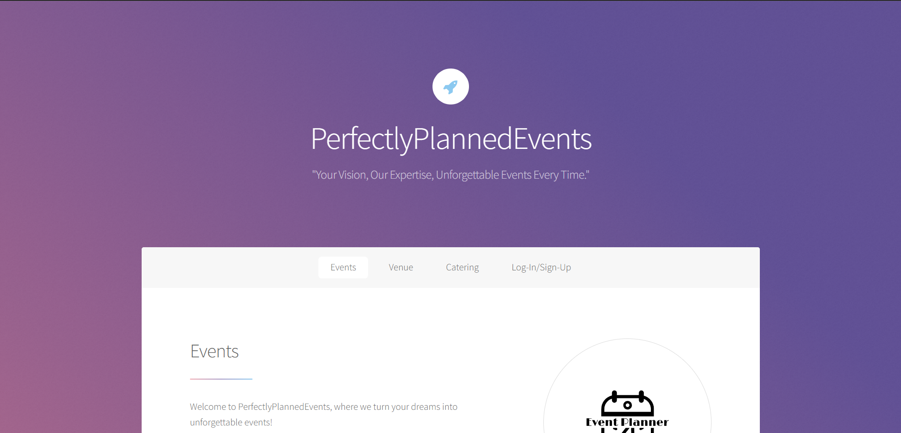
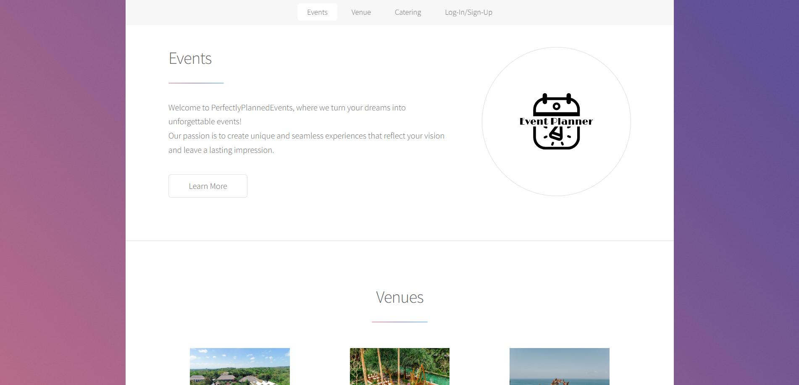
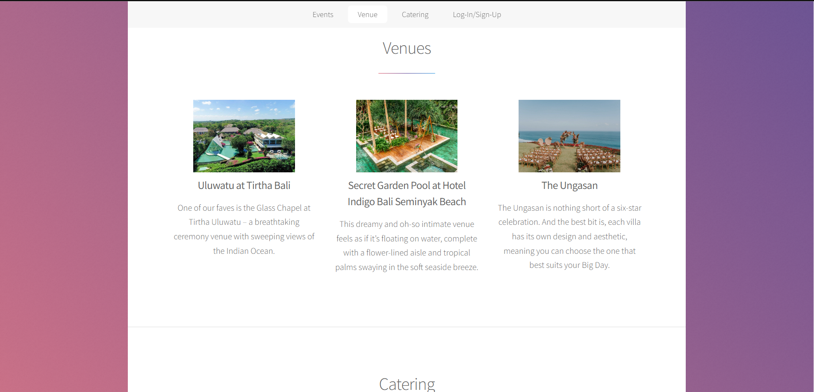
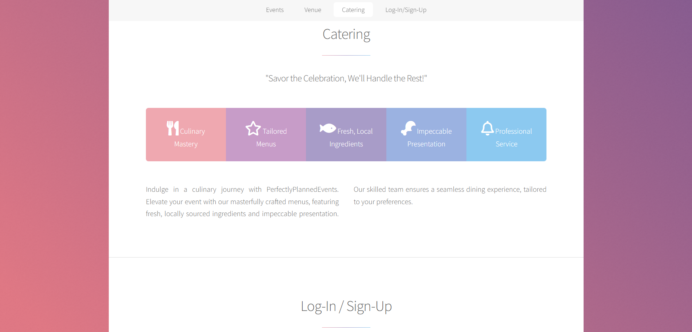
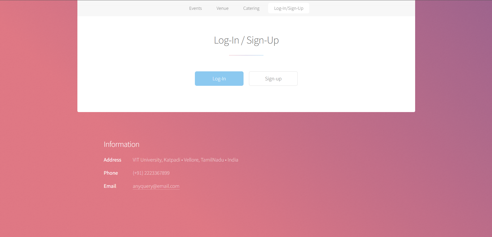

# Java Based Event Management System

Welcome to our Java-based Event Management System! This system is designed to cater to various types of events, providing a comprehensive solution for planning and organizing events of different categories. Whether you're arranging a social gathering, wedding, corporate conference, sports tournament, or any other type of event, our system has you covered.

## Live Link:  https://iceberg-15.github.io/PerfectlyPlannedEvents/

## Types of Events Supported

Our Event Management System supports the following types of events:

- **Social Events**: Plan and manage gatherings such as birthdays, reunions, or casual get-togethers.
- **Weddings**: Organize all aspects of weddings, including venue selection, guest management, and vendor coordination.
- **Parties**: Coordinate parties of any size, from small house parties to large-scale celebrations.
- **Anniversaries**: Plan memorable anniversary celebrations with personalized touches.
- **Corporate Events**: Manage corporate functions, team-building events, or company-wide conferences.
- **Conferences**: Organize professional conferences, including speaker management and session scheduling.
- **Seminars**: Host educational seminars or workshops with seamless registration and attendee tracking.
- **Sports Events**: Coordinate sports tournaments, leagues, or matches with scheduling and results management.

## Features

Our Event Management System provides a range of features tailored to each event type:

- **Event Creation**: Easily create new events specifying details like date, time, location, and event type.
- **Guest Management**: Manage guest lists, send invitations, and track RSVPs.
- **Vendor Coordination**: Connect with vendors for catering, decorations, photography, etc., and manage vendor contracts.
- **Agenda Management**: Plan event agendas, including sessions, speakers, and activities.
- **Venue Selection**: Explore and select suitable venues based on event requirements.
- **Registration and Ticketing**: Set up event registration, ticketing, and payment processing.

## Technologies Used

Our system is built using Java technologies for the backend, and may include the following components:

- **Java Servlets and JSP**: Handling backend logic and dynamic web content generation.
- **Database Integration**: Utilizing databases like MySQL or PostgreSQL for data storage and retrieval.
- **HTML/CSS/JavaScript**: Frontend components for user interfaces and interactivity.
- **Frameworks and Libraries**: Leveraging Java frameworks like Spring for dependency injection and MVC architecture.
- **Security Measures**: Implementing secure authentication and data encryption techniques.

## Getting Started

To run the Event Management System locally, follow these steps:

1. **Clone the repository**:
   ```bash
   git clone https://github.com/IceBerG-15/PerfectlyPlannedEvents.git
    ```
2. **Go to the directory**
   ```bash
   cd PerfectlyPlannedEvents
   ```
3. **Set up your Java development environment:**
    Ensure you have Java Development Kit (JDK) installed.
    Install Apache Tomcat or another servlet container for deploying the application.
    Import the project into your preferred Java IDE (e.g., Eclipse, IntelliJ IDEA).
4. **Build and run the application:**
    Deploy the application on your local server (Tomcat) and access it via http://localhost:8080/event-management-system.

## Contributing

Contributions to this project are welcome! Feel free to fork the repository, make improvements, and submit pull requests.

## Screenshots:









## Authors:
### Sidhant Sharma     https://github.com/IceBerG-15
### Mehul Verma        https://github.com/MehulVerma17
### Srijan Dutta       https://github.com/Errorby-Night


